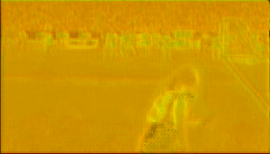

# MANet: Improving Video Denoising with a Multi-Alignment Network (ICIP'2022)
In this repository we provide code of the paper:
> **MANet: Improving Video Denoising with a Multi-Alignment Network**

> Yaping Zhao, Haitian Zheng, Zhongrui Wang, Edmund Y. Lam

> arxiv link: https://arxiv.org/abs/2202.09704

# Results
 Input | Output
 ----- | ------ 
|

 Flow 1 | Flow 2 | Flow 3 | Flow 4
 ------ | ------ | ------ | ------
|||

# Usage
0. For pre-requisites, run:
```
conda env create -f environment.yml
conda activate manet
```
1. Pretrained model is currently available at [Google Drive](https://drive.google.com/file/d/1yf9OTLtHVTcXHQ3o7Gdn-Xdt83ThTxT6/view?usp=sharing) and [Baidu Netdisk](https://pan.baidu.com/s/1e_akaLFpdCc-EJ7B7aIN8Q) (password: tof6), download the `11.pth` and put it in the `snapshots/multi_flow...batchsize_1/` folder. 

2. For MANet training, run:
```
python train_FlowNet_ms_warping_multi.py  \
--batch_size_train 1 \
--batch_size_test 1  \
--test_or_train train \
--test_snapshot_file 11.pth \
--cuda_devices 0
```
**This repository only uses several training sample for demo purpose. If you want to train your own model, please prepare your own training set.** 

3. For MANet testing, run:
```
python train_FlowNet_ms_warping_multi.py  \
--batch_size_train 1 \
--batch_size_test 1  \
--test_or_train test \
--test_snapshot_file 11.pth \
--cuda_devices 0
```
**This repository only uses several testing sample for demo purpose. If you want to train your own model, please prepare your own training set.** 

4. If positive, you will get results in the `snapshots/[model_name]/visualization_train/` folder when training and results in the `snapshots/[model_name]/visualization_test/` folder when testing.

# Dataset
Dataset is stored in the folder `dataset/`, where subfolder `vimeo_septuplet/` contains only several samples for demo purpose.
Images in `sequences/` and `sequences_noise` are ground truth clean images and noisy images, respectively.

`sep_testlist.txt` and `sep_trainlist.txt` could be modified for your experiment on other datasets. 


# Citation
Cite our paper if you find it interesting!
```
@article{zhao2022manet,
  title={MANet: Improving Video Denoising with a Multi-Alignment Network},
  author={Zhao, Yaping and Zheng, Haitian and Wang, Zhongrui and Luo, Jiebo and Lam, Edmund Y},
  journal={arXiv preprint arXiv:2202.09704},
  year={2022}
}
```
